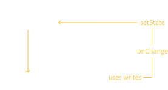

import "./scripts.js";
export { default as theme } from "./theme";
import { Appear } from "mdx-deck";
import { Head, Image } from "mdx-deck";
import nightOwl from "prism-react-renderer/themes/nightOwl";
import { CodeSurfer } from "mdx-deck-code-surfer";
import { Tester } from "./tester";

<Head>
  <title>bambuu React Intermediate slides</title>
</Head>

# Intermediate React

### Getting better at React

by Jeppe Reinhold and Gustav Wengel

---

# Introduction & Setup

## Part 1

---

<ul style={{ fontSize: "1.5em" }}>
  <li>We are Jeppe and Gustav</li>
  <Appear>
    <li>
      We’ve done web development and specifically React
      development for two years
    </li>
    <li>The workshop is split into 6 parts</li>
    <li>
      Each with a short presentation followed, by you doing
      exercises
    </li>
    <li>
      We might add or remove exercises during the workshop,
      to account for your specific level
    </li>
  </Appear>
</ul>

---

# Agenda

<ol style={{ fontSize: "1.5em" }}>
  <Appear>
    <li>Introduction and setup</li>
    <li>Lists and forms</li>
    <li>Component Patterns 1: Higher-Order Components</li>
    <li>Routing and the location</li>
    <li>Component Patterns 2: Render Props</li>
    <li>Global state with the Context API</li>
  </Appear>
</ol>

---

# Demonstration

## What we'll build

[Final application](LINK-TO-FINAL-APPLICATION)

---

# How we'll build it

<ul style={{ fontSize: "1.5em" }}>
  <Appear>
    <li>
      We have a git repository with all exercises (and
      slides)
    </li>
    <li>
      Each part has its own directory with assignments
    </li>
    <li>
      We will be working on the same application throughout
      the workshop
    </li>
    <li>
      So you can always see the solution, by peaking in the
      directory for the next part
    </li>
  </Appear>
</ul>

---

# Demonstration

## How it is setup

---

# Assignments - Part 1

1. Clone or download the git repo - [github.com/bambuu/intermediate-react](https://github.com/bambuu/intermediate-react)
2. Open the project with your favorite editor
3. Run `npm run setupAll`
4. Installing all parts might take some time, grab some coffee. ☕️
4. Run `npm run part1`
5. Make sure it works by visiting [localhost:3000](http://localhost:3000)

---

# Working with forms and lists

## Part 2

---

# Component keys 🔑

<ul style={{ fontSize: "1.5em" }}>
  <Appear>
    <li>
      React needs a way to uniquely identify components
    </li>
    <li>Usually this is handled by React</li>
    <li>
      But when you <b>dynamically render lists</b>, React
      can't do that automatically
    </li>
    <li>
      Therefore we have to add a <code>key</code> prop to
      each element in our list
    </li>
  </Appear>
</ul>

---

# Dynamically rendering lists? 🤔

- When you have an array of items that you use to build JSX elements with
- 99 % of the time you use `array.map()` to do this

---

<CodeSurfer
  title="array.map()"
  code={require("!raw-loader!./examples/array-map-faulty.js")}
  lang="jsx"
  showNumbers={true}
  theme={nightOwl}
  steps={[
    { range: [1, 8] },
    { lines: [2] },
    {
      range: [2, 5],
      notes: "map array values to JSX elements"
    },
    { lines: [7], notes: "return created elements" },
    { range: [10, 16], notes: "output" }
  ]}
/>

---

---

<CodeSurfer
  title="array.map()"
  code={require("!raw-loader!./examples/array-map.js")}
  lang="jsx"
  showNumbers={true}
  theme={nightOwl}
  steps={[
    {
      range: [3, 5],
      notes: "adding 'key' prop to element"
    },
    { range: [10, 16], notes: "output" }
  ]}
/>

---

# Don't use the array index as key!

<ul style={{ fontSize: "1.5em" }}>
  <Appear>
    <li>What happens if the array gets reordered?</li>
    <li>
      Or if an item in the middle of the array is removed?
    </li>
    <li>Or added?</li>
    <li>
      Indexes are not bound to the item, only its{" "}
      <b>position</b>!
    </li>
  </Appear>
</ul>

---

# Controlled components 🎛

### How we get user input into our React world

#### (... how to do forms, baiscally)

---

# The problem

You want read the value from an `<input/>` element and do stuff with it

<ul style={{ fontSize: "1.5em" }}>
  <Appear>
    <li>Submit form to backend</li>
    <li>Validation</li>
    <li>Conditional rendering</li>
  </Appear>
</ul>

---

<CodeSurfer
  title="Controlled components"
  code={require("!raw-loader!./examples/controlled-base.js")}
  lang="jsx"
  showNumbers={true}
  theme={nightOwl}
  steps={[
    { range: [1, 17] },
    { range: [9, 14] },
    { range: [2, 5] }
  ]}
/>

---

## We must control it!

Pulling the `value` of the `<input/>` up to the component `state`

---

<CodeSurfer
  title="Controlled components"
  code={require("!raw-loader!./examples/controlled-final.js")}
  lang="jsx"
  showNumbers={true}
  theme={nightOwl}
  steps={[
    {
      range: [2, 4],
      notes:
        "Create a component state that will hold the value"
    },
    {
      lines: [21, 22, 23, 25],
      notes: "Set the value to be that state"
    },
    {
      range: [21, 25],
      notes: "Listen for changes on the input"
    },
    {
      range: [6, 11],
      notes: "Update the state on each change"
    },
    {
      range: [13, 16],
      notes: "Now we can access the value from anywhere"
    },
    { notes: "Done! 🥳" }
  ]}
/>

---

# Using `ref` to reference native elements ⏩

---

# The problem

You want to do something with the actual DOM element

<ul style={{ fontSize: "1.5em" }}>
  <Appear>
    <li>
      Managing focus, text selection, or media playback
    </li>
    <li>Integrating with third-party DOM libraries</li>
  </Appear>
</ul>

---

<CodeSurfer
  title="How do we do that within React?"
  code={require("!raw-loader!./examples/ref-base.js")}
  lang="jsx"
  showNumbers={true}
  theme={nightOwl}
  steps={[{}, { range: [6, 13] }, { range: [2, 4] }]}
/>

---

# Do it like we always do?

<ul style={{ fontSize: "1.5em" }}>
  <Appear>
    <li>
      <code>document.getElementById('id');</code>
    </li>
    <li>
      <code>document.querySelector('.theClass');</code>
    </li>
    <li>It's not the React way</li>
    <li>
      React works on the DOM, so you don't have to (and
      shouldn't)
    </li>
    <li>
      We don't know what happens in the DOM, so it's
      dangerous to interact with it directly
    </li>
  </Appear>
</ul>

---

# `ref` to the rescue!

<ul style={{ fontSize: "1.5em" }}>
  <Appear>
    <li>
      Reference the native element from a class variable
    </li>
    <li>
      The class variable is now a "DOM element" given to you
      by React
    </li>
    <li>Now we can do anything with it, within React!</li>
  </Appear>
</ul>

---

<CodeSurfer
  title="Adding a ref"
  code={require("!raw-loader!./examples/ref-final.js")}
  lang="jsx"
  showNumbers={true}
  theme={nightOwl}
  steps={[{ lines: [2] }, { lines: [11] }, { lines: [5] }]}
/>

---

# Assignments - Part 2

1. Setup the 'Part 2' project
2. Add `keys` to lists
3. Building a form using the Controlled Component technique
4. Managing focus with `refs`
5. 🏖

---

# Higher-Order Components

## Part 3

---

# The problem

We want to share behavior between components

<ul style={{ fontSize: "1.5em" }}>
  <Appear>
    <li>Subscribing to same data sources</li>
    <li>React to same events (scroll, resize, etc.)</li>
    <li>Read from the Location (URL)</li>
    <li>Interact with global theme or state</li>
  </Appear>
</ul>

---

# The solutions

## Composition 🥰 vs. inheritance 🤕

<ul style={{ fontSize: "1.5em" }}>
  <Appear>
    <li>React is built around composition 💪</li>
    <li>
      Inheritance in JavaScript <em>is</em> technically
      possible, but not favorable
    </li>
    <li>Extending a class component? 🙅‍♀️</li>
  </Appear>
</ul>

---

<blockquote style={{ fontSize: "1.5em" }}>
  <i>
    "We haven’t found any use cases where we would recommend
    creating component inheritance hierarchies."
  </i>
  
- Facebook, maintains over 30.000 components

</blockquote>

---

# HOC

## Component Pattern 1

<ul style={{ fontSize: "1.5em" }}>
  <Appear>
    <li>
      Wrap a component in a HOC, that passes functionality
      via <code>props</code>
    </li>
    <li>
      HOCs are just function that takes in any component,
      and returns an <em>enhanced component</em>
    </li>
    <li>
      We've never written our own HOC before, only used
      libraries with HOCs
    </li>
  </Appear>
</ul>

---

do we need some diagram here, showing a HOC wrapping to components, to give them functionality?
boxes containing other boxes

---

<CodeSurfer
  title="Using a HOC"
  code={require("!raw-loader!./examples/basic-hoc-usage.js")}
  lang="jsx"
  showNumbers={true}
  theme={nightOwl}
  steps={[
    {
      range: [1, 10],
      notes: "A network aware Order button"
    },
    { lines: [1], notes: "Basic order button" },
    {
      range: [5, 9],
      notes: "Disable button if there is no network"
    },
    {
      lines: [2, 3],
      notes: "Get current network status from prop"
    },
    {
      range: [12, 14],
      notes: "Wrap with HOC to enhance component"
    }
  ]}
/>

---

<CodeSurfer
  title="Building a withNetwork HOC"
  code={require("!raw-loader!./examples/with-network-hoc.js")}
  lang="jsx"
  showNumbers={true}
  theme={nightOwl}
  steps={[
    {
      range: [1, 24],
      notes: "the withNetwork HOC"
    },
    {
      lines: [1],
      notes: () => (
        

          Take in any WrappedComponent -{" "}
          <code>withNetwork(MyComponent)</code>
        

      )
    },
    {
      lines: [2],
      notes: "Build the wrapping component"
    },
    {
      lines: [3],
      notes:
        "Set initial state of HOC to current network status"
    },
    {
      range: [5, 8],
      notes:
        "When HOC mount, listen for network changes and set state"
    },
    {
      range: [5, 13],
      notes:
        "When HOC mount, listen for network changes and set state"
    },
    {
      range: [15, 22],
      notes: "Render WrappedComponent with online status"
    },
    {
      lines: [19],
      notes:
        "Remember to pass all other props along to the WrappedComponent"
    },
    {
      range: [1, 24],
      notes: "Done! 🥳"
    }
  ]}
/>

---

## Higher-Order Components

<ul style={{ fontSize: "1.5em" }}>
  <Appear>
    <li>
      HOCs are just function that takes in any component,
      and returns an <em>enhanced component</em>
    </li>
    <li>Always beware of premature composition 🤓</li>
  </Appear>
</ul>

---

# Assignments - Part 3

1. ????
2. 🏖

---

# The end - Testing stuff

- add "Read More" links everywhere
- probably test that examples actually works (the do at least prettify)
- stream line codes using prettier ignore
- parantheses around all arguments
- copy "public" folder after build

<Tester />
