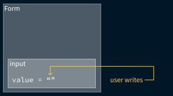
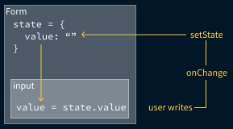

import "./scripts.js";
export { default as theme } from "./theme";
import { Appear } from "mdx-deck";
import { Head, Image } from "mdx-deck";
import { Split } from "mdx-deck/layouts";
import nightOwl from "prism-react-renderer/themes/nightOwl";
import { CodeSurfer } from "mdx-deck-code-surfer";
import { Code } from "./components/code";
import { ReadMore } from "./components/read-more";

<Head>
  <title>bambuu React Intermediate slides</title>
</Head>

# Intermediate React

### Getting better at React

by Jeppe Reinhold and Gustav Wengel

---

# Introduction & Setup

## Part 1

---

<ul style={{ fontSize: "1.5em" }}>
  <li>We are Jeppe and Gustav</li>
  <Appear>
    <li>
      We’ve done web development and specifically React
      development for two years
    </li>
    <li>The workshop is split into 6 parts</li>
    <li>
      Each with a short presentation followed, by you doing
      exercises
    </li>
    <li>
      We might add or remove exercises during the workshop,
      to account for your specific level
    </li>
  </Appear>
</ul>

---

# Agenda

<ol style={{ fontSize: "1.5em" }}>
  <Appear>
    <li>Introduction and setup</li>
    <li>Lists and forms</li>
    <li>Component Patterns 1: Higher-Order Components</li>
    <li>Routing and the location</li>
    <li>Component Patterns 2: Render Props</li>
    <li>Global state with the Context API</li>
  </Appear>
</ol>

---

# Demonstration

## What we'll build

[Final application](LINK-TO-FINAL-APPLICATION)

---

# How we'll build it

<ul style={{ fontSize: "1.5em" }}>
  <Appear>
    <li>Git repository with all exercises (and slides)</li>
    <li>
      Each part has its own directory with assignments
    </li>
    <li>
      We will be working on the same application throughout
      the workshop
    </li>
    <li>
      You can always see the solution, by peaking in the
      directory for the next part
    </li>
  </Appear>
</ul>

---

# Demonstration

## How it is setup

---

# Assignments - Part 1

1. Clone or download the git repo - [github.com/bambuu/intermediate-react](https://github.com/bambuu/intermediate-react)
2. Open the project with your favorite editor
3. Run `npm run setupAll`
4. Installing all parts might take some time, grab some coffee. ☕️
5. Run `npm run part1`
6. Make sure it works by visiting [localhost:3000](http://localhost:3000)

---

# Working with lists and forms

## Part 2

---

# Component keys 🔑

<ul style={{ fontSize: "1.5em" }}>
  <Appear>
    <li>
      React needs a way to uniquely identify components
    </li>
    <li>Usually this is handled by React</li>
    <li>
      But when you <b>dynamically render lists</b>, React
      can't do that automatically
    </li>
    <li>
      We have to add a <code>key</code> prop to each element
      in our list
    </li>
  </Appear>
</ul>

---

# Dynamically rendering lists? 🤔

- You have an array of items that you use to build JSX elements with
- 99 % of the time you use `array.map()` to do this

---

<CodeSurfer
  title="array.map()"
  code={require("!raw-loader!./examples/array-map-simple.js")}
  lang="javascript"
  showNumbers={true}
  theme={nightOwl}
  steps={[
    { lines: [1], notes: "Define a list of cities" },
    {
      range: [3, 5],
      notes: "Go through each city, and change it"
    },
    {
      tokens: {
        3: [8, 9, 10, 11, 12, 13, 14],
        4: [1, 2, 3, 4, 5, 6, 7, 8, 9],
        5: [1]
      }
    },
    {
      range: [7, 12],
      notes: "Result is the array with the changes"
    }
  ]}
/>

---

<CodeSurfer
  title="array.map()"
  code={require("!raw-loader!./examples/array-map-faulty.js")}
  lang="jsx"
  showNumbers={true}
  theme={nightOwl}
  steps={[
    { range: [1, 12] },
    { range: [2, 6], notes: "Our list of animals" },
    {
      range: [7, 9],
      notes: "map array values to JSX elements"
    },
    { lines: [11], notes: "return created elements" },
    { range: [14, 20], notes: "output" }
  ]}
/>

---


---

<CodeSurfer
  title="array.map()"
  code={require("!raw-loader!./examples/array-map.js")}
  lang="jsx"
  showNumbers={true}
  theme={nightOwl}
  steps={[
    {
      range: [7, 9],
      notes: "adding a unique key to the element"
    },
    { range: [14, 20], notes: "output" }
  ]}
/>

---

# Don't use the array index as key!

If you use the index as a key, you'll get weird bugs in your lists

---

# Controlled components 🎛

### How we get user input into our React world

#### (... how to do forms, basically)

---

# The problem

You want read the value from an `<input/>` element and do stuff with it

<ul style={{ fontSize: "1.5em" }}>
  <Appear>
    <li>Submit form to backend</li>
    <li>Validation</li>
    <li>Conditional rendering</li>
  </Appear>
</ul>

---

<CodeSurfer
  title="Controlled components"
  code={require("!raw-loader!./examples/controlled-base.js")}
  lang="jsx"
  showNumbers={true}
  theme={nightOwl}
  steps={[
    { range: [1, 16] },
    { range: [8, 13] },
    { range: [2, 4] }
  ]}
/>

---

## We must control it!

Pulling the `value` of the `<input/>` up to the component `state`

<div
  className="stacked-container"
  style={{ width: "80vw", height: "50vh" }}
>
  <Appear>
    
    
    <div />
  </Appear>
</div>

---

<CodeSurfer
  title="Controlled components"
  code={require("!raw-loader!./examples/controlled-final.js")}
  lang="jsx"
  showNumbers={true}
  theme={nightOwl}
  steps={[
    {
      range: [2, 4],
      notes:
        "Create a component state that will hold the value"
    },
    {
      lines: [19, 20, 21, 23],
      notes: "Set the value to be that state"
    },
    {
      range: [19, 23],
      notes: "Listen for changes on the input"
    },
    {
      range: [6, 9],
      notes: "Update the state on each change"
    },
    {
      range: [11, 14],
      notes: "Now we can access the value from anywhere"
    },
    { notes: "Done! 🥳" }
  ]}
/>

---

# Assignments - Part 2

1. Setup the 'Part 2' project
2. Add `keys` to lists
3. Building a form using the Controlled Component technique
4. 🏖

<ReadMore link="reactjs.org/docs/lists-and-keys"/>
<br/>
<ReadMore link="reactjs.org/docs/forms"/>

---

# Higher-Order Components

## Part 3

---

# The problem

We want to share behavior between components

<ul style={{ fontSize: "1.5em" }}>
  <Appear>
    <li>Subscribing to same data sources</li>
    <li>React to same events (scroll, resize, etc.)</li>
    <li>Read from the Location (URL)</li>
  </Appear>
</ul>

---

# The solutions

## Composition 🥰 vs. inheritance 🤕

<ul style={{ fontSize: "1.5em" }}>
  <Appear>
    <li>React is built around composition 💪</li>
    <li>
      Inheritance in JavaScript <em>is</em> technically
      possible, but not favorable
    </li>
    <li>Extending a class component? 🙅‍♀️</li>
  </Appear>
</ul>

---

<blockquote style={{ fontSize: "1.5em" }}>
  <i>
    "We haven’t found any use cases where we would recommend
    creating component inheritance hierarchies."
  </i>
  <p>- Facebook, maintains over 30.000 components</p>
</blockquote>

---

# HOC

## Component Pattern 1

<ul style={{ fontSize: "1.5em" }}>
  <Appear>
    <li>
      Wrap a component in a HOC, that passes functionality
      via <code>props</code>
    </li>
    <li>
      HOCs are functions that takes in any component, and
      returns an <em>enhanced component</em>
    </li>
    <li>
      We've never written our own HOC before, only used
      libraries with HOCs
    </li>
  </Appear>
</ul>

---

<CodeSurfer
  title="Using a HOC"
  code={require("!raw-loader!./examples/hoc-usage.js")}
  lang="jsx"
  showNumbers={true}
  theme={nightOwl}
  steps={[
    {
      range: [1, 10],
      notes: "A network aware Order button"
    },
    { lines: [1], notes: "Basic order button" },
    {
      range: [5, 9],
      notes: "Disable button if there is no network"
    },
    {
      lines: [2, 3],
      notes: "Get current network status from prop"
    },
    {
      range: [12, 14],
      notes: "Wrap with HOC to enhance component"
    }
  ]}
/>

---

<CodeSurfer
  title="Building a withNetwork HOC"
  code={require("!raw-loader!./examples/with-network-hoc.js")}
  lang="jsx"
  showNumbers={true}
  theme={nightOwl}
  steps={[
    {
      range: [1, 24],
      notes: "the withNetwork HOC"
    },
    {
      lines: [1],
      notes: () => (
        <p>
          Take in any WrappedComponent -{" "}
          <code>withNetwork(MyComponent)</code>
        </p>
      )
    },
    {
      lines: [2],
      notes: "Build the wrapping component"
    },
    {
      lines: [3],
      notes:
        "Set initial state of HOC to current network status"
    },
    {
      range: [5, 8],
      notes:
        "When HOC mount, listen for network changes and set state"
    },
    {
      range: [5, 13],
      notes:
        "When HOC mount, listen for network changes and set state"
    },
    {
      range: [15, 22],
      notes: "Render WrappedComponent with online status"
    },
    {
      lines: [19],
      notes:
        "Remember to pass all other props along to the WrappedComponent"
    },
    {
      range: [1, 24],
      notes: "Done! 🥳"
    }
  ]}
/>

---

## Higher-Order Components

<ul style={{ fontSize: "1.5em" }}>
  <Appear>
    <li>
      HOCs are functions that takes in any component, and
      returns an <em>enhanced component</em>
    </li>
    <li>Always beware of premature composition 🤓</li>
  </Appear>
</ul>

---

# Assignments - Part 3

1. Listen for scrolling events in the `<HeroList/>`
2. Use a `withScroll()` HOC to do it instead
3. 🏝

<ReadMore link="reactjs.org/docs/higher-order-components" />

---

# Routing 🛣

## Part 4

---

# The Problem

.. is easier to show than tell

```notes
Open new tab
Problems:
- URL doesn't change
- Browser history doesn't change
- Reload
- Share location
- Press back
- New tab
```

---

<CodeSurfer
  title="Managing pages in React state 😔"
  code={require("!raw-loader!../part4/src/App.js")}
  lang="jsx"
  showNumbers={true}
  theme={nightOwl}
  steps={[
    {
      range: [8, 39],
      notes: "The App.js in part 4"
    },
    {
      range: [9, 15],
      notes: "the currentPage state"
    },
    {
      range: [29, 37],
      notes: "Returned from render()"
    },
    {
      range: [17, 22],
      notes: "default mainComponent"
    },
    {
      range: [24, 25],
      notes: "mainComponent if currentPage === /theming"
    },
    { range: [26, 28] }
  ]}
/>

---

### All the things you expect from a traditional website, you have to implement yourself in a single-page application

---

# The solution 🛣

<ul style={{ fontSize: "1.5em" }}>
  <Appear>
    <li>Use a routing library</li>
    <li>
      There are <em>many</em> to choose from, just go with{" "}
      <code>
        <a
          target="_blank"
          href="https://reacttraining.com/react-router/web"
        >
          React Router
        </a>
      </code>
    </li>
    <li>
      Manages location (URL) and browser history for you
    </li>
    <li>
      Always shows the correct component, based on the
      current location
    </li>
    <li>
      Beware: There is a big difference with React Router v3
      and v4
    </li>
  </Appear>
</ul>

---

## The three main concepts of React Router

<ul style={{ fontSize: "1.5em" }}>
  <Appear>
    <li>
      <Code code="<Link/>" /> - To navigate between pages
      (replaces <Code code="<a>" /> tags)
    </li>
    <li>
      <Code code="<Route/>" /> - To configure which location
      must render which component
    </li>
    <li>
      <Code code="<BrowserRouter/>" /> - Handles updating
      the location
    </li>
  </Appear>
</ul>

---

<CodeSurfer
  title="Using the <Link/> component"
  code={require("!raw-loader!./examples/link.js")}
  lang="jsx"
  showNumbers={true}
  theme={nightOwl}
  steps={[
    {
      notes: "A simple sidebar navigation"
    },
    {
      lines: [1],
      notes: "Import Link"
    },
    {
      lines: [6],
      notes: "Link to / (root)"
    },
    {
      lines: [7],
      notes: "Link to /heroes"
    },
    {
      lines: [8],
      notes: "Link to /villains"
    }
  ]}
/>

---

<CodeSurfer
  title="Using the <Route/> component"
  code={require("!raw-loader!./examples/routes.js")}
  lang="jsx"
  showNumbers={true}
  theme={nightOwl}
  steps={[
    {
      notes: "Simple route container"
    },
    {
      lines: [1],
      notes: "Import Route"
    },
    {
      lines: [6],
      notes:
        "Show Heroes component when location is /heroes"
    },
    {
      lines: [7],
      notes:
        "Show Villains component when location is /villains"
    },
    {
      lines: [8],
      notes: "Show Home component when location is /"
    }
  ]}
/>

---

<CodeSurfer
  title="Using the <BrowserRouter/> component"
  code={require("!raw-loader!./examples/router.js")}
  lang="jsx"
  showNumbers={true}
  theme={nightOwl}
  steps={[
    {
      notes: "Simple routed app"
    },
    {
      lines: [1],
      notes: "Import BrowserRouter"
    },
    {
      lines: [5, 10],
      notes:
        "The BrowserRouter needs to be above all your <Link/> and <Route/>"
    },
    {
      range: [5, 10],
      notes:
        "Can contain any components, with deeply nested <Link/> and <Route/>"
    }
  ]}
/>

---

# Using React Router

<ol>
  <Appear>
    <li>
      Have a top-level <Code code="<BrowserRouter/>" /> in
      your app
    </li>
    <li>
      Navigate between pages with
      <Code code="<Link to='/location'/>" />
    </li>
    <li>
      Map locations to components with
      <br />
      <Code code="<Route path='/location' component={Component}/>" />
    </li>
  </Appear>
</ol>

---


---

## When to route - and when to just conditionally render? 🧐

<ul style={{ fontSize: "1.5em" }}>
  <Appear>
    <li>Do you want the view to be deep linkable?</li>
    <li>... the back button to change view?</li>
  </Appear>
</ul>

---

# Assignments - Part 4

1. Implement routing in the Heroes app
2. Show the current location in the header using the `withRouter()` HOC
3. ⛱

<ReadMore link="reacttraining.com/react-router/web" />

---

# Render props 🎥

## Part 5

---

## 'Render props' is a component pattern, like HOC

<ul style={{ fontSize: "1.2em" }}>
  <Appear>
    <li>
      Solves the same problem as HOCs: sharing common
      behavior 🤝
    </li>
    <li>
      HOCs wrap a component and{" "}
      <em>inject behavior via props</em>
    </li>
    <li>
      Render props instead render a component, that passes
      the behavior to the component{" "}
      <em>
        from within the <Code code="render()" /> method
      </em>
    </li>
    <li>
      Render props are sometimes refered to as{" "}
      <em>"function as a child"</em>
    </li>
  </Appear>
</ul>

---

# 🤨

Don't worry if it doesn't make sense, it's easier to understand when you try it.

---

# 👍

We teach you both patterns because you will most likely use both when you start using libraries.

---

## Child components and the `children` prop

<ul style={{ fontSize: "1.2em" }}>
  <Appear>
    <li>
      The special <Code code="props.children" /> prop can be
      used to render all children of a component
    </li>
    <li>
      Then we can have "containing" components that wraps
      whatever their children are
    </li>
    <li>
      Child components are defined in JSX like regular HTML
    </li>
  </Appear>
</ul>

---

<CodeSurfer
  title="The children prop"
  code={require("!raw-loader!./examples/children-prop.js")}
  lang="jsx"
  showNumbers={true}
  theme={nightOwl}
  steps={[
    {
      range: [1, 9],
      notes:
        "Putting HeroList inside the FancyBorder component, as a child"
    },
    {
      range: [11, 18],
      notes: "Rendering children inside the FancyBorder"
    },
    {}
  ]}
/>

---

<CodeSurfer
  title="child as a function"
  code={require("!raw-loader!./examples/children-prop-function.js")}
  lang="jsx"
  showNumbers={true}
  theme={nightOwl}
  steps={[
    {
      range: [1, 12],
      notes: "Giving a function as a child to FancyBorder"
    },
    {
      range: [5, 8]
    },
    {
      range: [14, 21],
      notes: "props.children() is now invoked as a function"
    },
    {}
  ]}
/>

---

<CodeSurfer
  title="Using a Network render prop"
  code={require("!raw-loader!./examples/render-prop-usage.js")}
  lang="jsx"
  showNumbers={true}
  theme={nightOwl}
  steps={[
    {
      notes: "Our network aware OrderPizzaButton"
    },
    {
      range: [1, 2],
      notes: "The basics"
    },
    {
      range: [7, 11],
      notes: "The usual JSX"
    },
    {
      lines: [5, 13],
      notes: "Render an outer <Network/> component"
    },
    {
      lines: [5, 6, 12, 13],
      notes:
        'Child of <Network/> component is a function - "function as a child"'
    },
    {
      tokens: { 6: [2, 3, 4, 5, 6, 7, 8] },
      notes: "Child function gets behavior as arguments"
    },
    {
      range: [6, 12],
      notes: "Use arguments to return final result"
    },
    {
      range: [4, 14],
      notes:
        "In short, the Render prop component is added inside our JSX"
    }
  ]}
/>

---

When you get that you are _"just"_ passing a function as the child to `<Network/>`,
it becomes easier to understand 😇

---

Let us see how the Network Render prop component is implemented

---

<CodeSurfer
  title="Building the Network render prop"
  code={require("!raw-loader!./examples/network-render-prop.js")}
  lang="jsx"
  showNumbers={true}
  theme={nightOwl}
  steps={[
    {},
    {
      lines: [1],
      notes:
        "Directly exporting a class component, no class within a function or anything like the HOC"
    },
    {
      range: [2, 12],
      notes: "Same as before - in the withNetwork() HOC"
    },
    {
      range: [14, 16],
      notes:
        "Render the 'children' prop, and run it as a function. Pass relevant arguments"
    },
    { notes: "Done! 🥳" }
  ]}
/>

---

## Render prop vs HOC - When to use what?

<ul style={{ fontSize: "1.5em" }}>
  <Appear>
    <li>As you see, they solve the same problem</li>
    <li>
      It often comes down to a matter of taste, or what the
      library exposes
    </li>
    <li>(as we'll see first hand in the final part)</li>
  </Appear>
</ul>

---

# Personal rule of thumb guides

1. Use render props where you can
2. Use HOCs if you have to combine multiple in _same_ component
3. Use HOCs if you have to access enhancement in lifecycle methods

---

If you want to see a deeper comparison, check out ["Use A Render Prop!" by Michael Jackson](https://cdb.reacttraining.com/use-a-render-prop-50de598f11ce)

---

# Assignments - Part 5

1. Use the _function as a child_ pattern
2. Use a `<FormController/>` render prop to simplify our HeroList input
3. Submit new heroes using the new render prop
4. 🏕

<ReadMore link="reactjs.org/docs/render-props" />

---

# React Context API

# Part 6

---

## The Problem

<ul style={{ fontSize: "1.2em" }}>
  <Appear>
    <li>
      Passing information between components is done with{" "}
      <em>direct props</em>
    </li>
    <li>
      Cumbersome when passing through multiple components
    </li>
    <li>
      We have to pass it down via each component in between
    </li>
    <li>Global state, such as a theme or user info</li>
  </Appear>
</ul>

---

## The Problem

<div
  className="stacked-container"
  style={{ width: "90vw", height: "80vh" }}
>
  <Appear>
    
    
    
  </Appear>
</div>

---

# The Simple Solution

## Keeping the info out of the component tree

<ul style={{ fontSize: "1.2em" }}>
  <Appear>
    <li>Only works if the information is constant</li>
    <li>
      Declare constant as an object in a separate file
    </li>
    <li>Import it directly whereever it is needed</li>
  </Appear>
</ul>

---

# The Simple Solution


---

# The Context Solution

## Using React Context

<ul style={{ fontSize: "1.2em" }}>
  <Appear>
    <li>
      A <em>provider</em> in the tree, that provides the
      info to any descendants that <em>consumes</em> it
    </li>
    <li>
      We can "teleport" the info to any descendants, without
      using props
    </li>
  </Appear>
</ul>

---

# The Context Solution

<div
  className="stacked-container"
  style={{ width: "90vw", height: "80vh" }}
>
  
  <Appear>
    
  </Appear>
</div>

---

<CodeSurfer
  title="Basic Context"
  code={require("!raw-loader!./examples/context-basic.js")}
  lang="jsx"
  showNumbers={true}
  theme={nightOwl}
  steps={[
    {
      range: [1, 8],
      notes:
        "Defined theme object and ThemeContext in separate file"
    },
    {
      range: [10, 23],
      notes: "The component that will Provide the context"
    },
    {
      range: [10, 11],
      notes:
        "Import ThemeContext and theme to the component that provides it"
    },
    {
      range: [15, 21],
      notes:
        "Wrap components that need it with TemeContext.Provider, set value = theme"
    },
    {
      range: [25, 43],
      notes: "The component that will consume the context"
    },
    {
      range: [25, 26],
      notes: "Again, import the ThemeContext"
    },
    {
      lines: [30, 31, 40, 41],
      notes:
        "A context Consumer uses the Render prop pattern, get the context as parameter"
    },
    {
      range: [31, 40],
      notes:
        "Read from the context, and render anything with it"
    },
    {
      range: [28, 43]
    }
  ]}
/>

---

But we aren't actually changing the theme? 🤔

---

<CodeSurfer
  title="Dynamic Context"
  code={require("!raw-loader!./examples/context-state.js")}
  lang="jsx"
  showNumbers={true}
  theme={nightOwl}
  steps={[
    {
      range: [1, 9],
      notes:
        "Defined theme object and ThemeContext in separate file"
    },
    {
      range: [11, 40],
      notes: "The component that will Provide the context"
    },
    {
      range: [11, 16],
      notes:
        "Import ThemeContext and themes to the component that provides it"
    },
    {
      lines: [28, 29, 31],
      notes:
        "Put current theme in state of providing component"
    },
    {
      lines: [35],
      notes:
        "Set value to this.state instead of theme directly"
    },
    {
      range: [20, 26],
      notes:
        "function that changes the state in the providing component"
    },
    {
      range: [28, 31],
      notes:
        "put toggleTheme function in state, so it is part of context as well"
    },
    {
      range: [43, 62],
      notes: "The theme consuming component"
    },
    {
      range: [48, 50],
      notes: "theme is now an object INSIDE the context"
    },
    {
      range: [64, 80],
      notes:
        "The button to change the theme, also a consumer"
    },
    {
      range: [69, 78],
      notes:
        "use the toggleTheme function from the context, to change the state higher up"
    }
  ]}
/>

---

# React Context Gotchas

<ul style={{ fontSize: "1.2em" }}>
  <Appear>
    <li>
      The context is not magic, you still have to maintain
      and change the state manually
    </li>
    <li>
      It just enables you to pass props down, without
      touching all the components in between
    </li>
    <li>
      The Provider doesn't have to be top level, it just
      have to be above all consumers
    </li>
    <li>
      <b>Don't define the Provider value object inline</b>
    </li>
  </Appear>
</ul>

---

<CodeSurfer
  title="Dangerous object inline"
  code={`<Provider value={ {something: 'hello'} }>
  <SideBar/>
  <Main/>
</Provider>`}
  lang="jsx"
  showNumbers={true}
  theme={nightOwl}
  steps={[
    {
      notes:
        "The value in the Provider is now rebuilt every time, causing all consumers to re-render"
    }
  ]}
/>

---

# Assignments - Part 6

1. be cool
2. 🏕

<ReadMore link="reactjs.org/docs/context" />

---

export default Split;

<div
  style={{
    display: "flex",
    flexDirection: "column",
    fontSize: "2em"
  }}
>
  🙋‍♂️
  <a
    href="https://twitter.com/drreinhold"
    target="_blank"
    className="link"
  >
    @DrReinhold
  </a>
  <a
    href="mailto:jeppe@bambuu.dk"
    target="_blank"
    className="link"
  >
    jeppe@bambuu.dk
  </a>
</div>

<div
  style={{
    display: "flex",
    flexDirection: "column",
    fontSize: "2em"
  }}
>
  🙋‍♂️
  <a
    href="https://twitter.com/geewengel"
    target="_blank"
    className="link"
  >
    @GeeWengel
  </a>
  <a
    href="mailto:gustav@bambuu.dk"
    target="_blank"
    className="link"
  >
    gustav@bambuu.dk
  </a>
</div>
