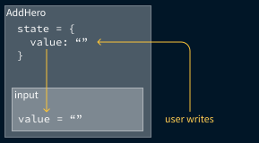
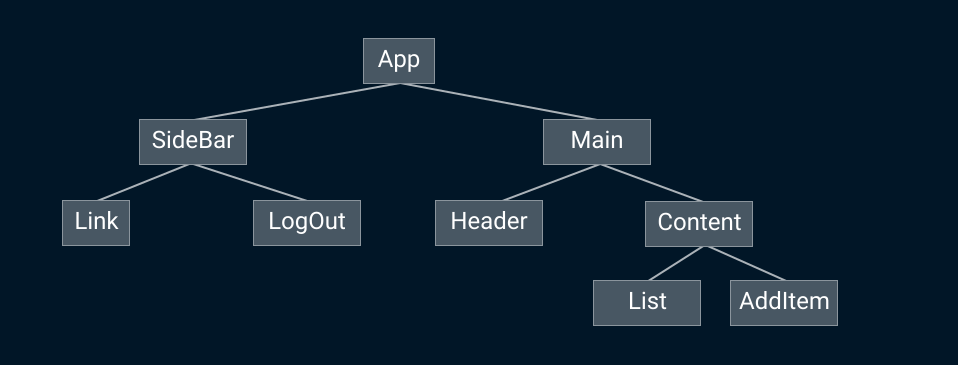
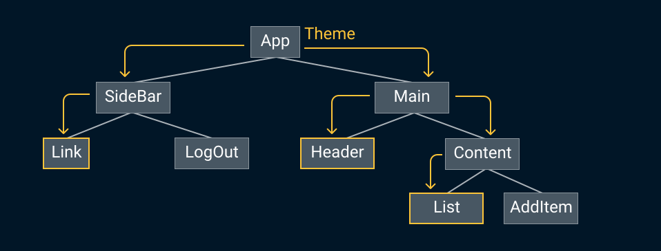
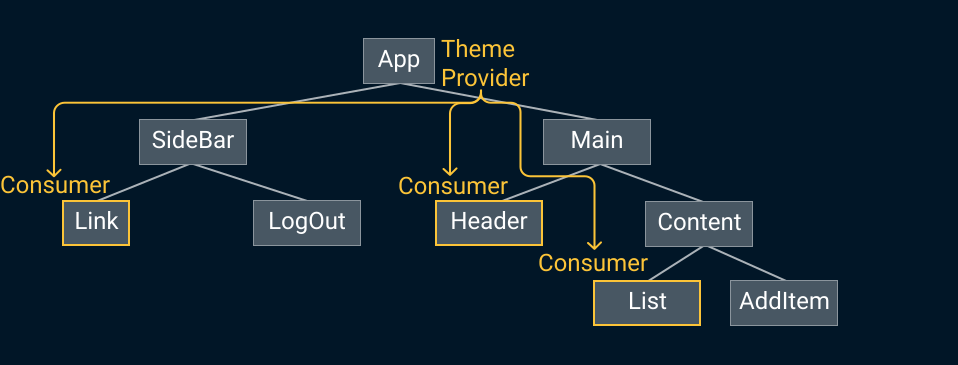
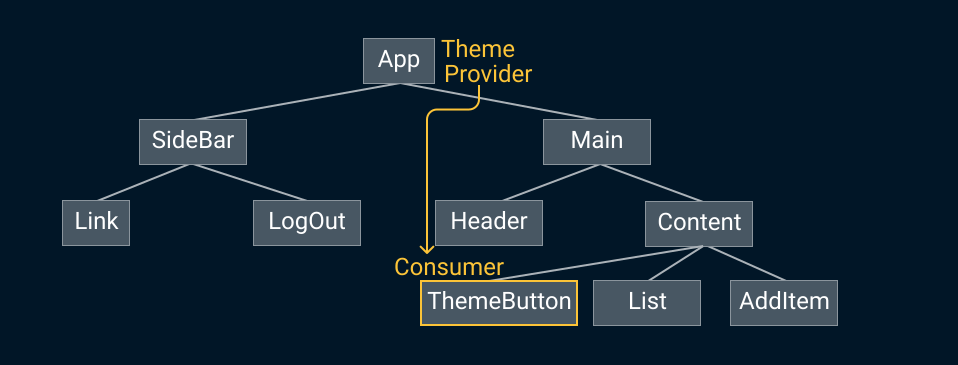

import "./scripts.js";
export { default as theme } from "./theme";
import { Appear } from "mdx-deck";
import { Head, Image } from "mdx-deck";
import { Split } from "mdx-deck/layouts";
import nightOwl from "prism-react-renderer/themes/nightOwl";
import { CodeSurfer } from "mdx-deck-code-surfer";
import { Code } from "./components/code";
import { CodeSurferNoZoom } from "./components/code-surfer-no-zoom";
import { ReadMore } from "./components/read-more";

<Head>
  <title>bambuu React Intermediate slides</title>
</Head>

# Intermediate React

### Getting better at React

by Jeppe Reinhold and Gustav Wengel

---

# Introduction & Setup

## Part 1

---

<ul style={{ fontSize: "1.5em" }}>
  <li>We are Jeppe and Gustav</li>
  <Appear>
    <li>We’ve done web development and specifically React development for two years</li>
    <li>The workshop is split into 6 parts</li>
    <li>Each with a short presentation followed, by you doing exercises</li>
  </Appear>
</ul>

---

# Agenda

<ol style={{ fontSize: "1.5em" }}>
  <Appear>
    <li>Introduction and setup</li>
    <li>Lists and forms</li>
    <li>Component Patterns 1: Higher-Order Components</li>
    <li>Routing and the location</li>
    <li>Component Patterns 2: Render Props</li>
    <li>Global state with the Context API</li>
  </Appear>
</ol>

---

# Demonstration

## What we'll build

---

# How we'll build it

<ul style={{ fontSize: "1.5em" }}>
  <Appear>
    <li>Git repository with all exercises (and slides)</li>
    <li>Each part has its own directory with assignments</li>
    <li>We will be working on the same application throughout the workshop</li>
    <li>You can always see the solution, by peaking in the directory for the next part</li>
  </Appear>
</ul>

---

# Demonstration

## How it is setup

---

# Demonstration

## The components we'll be working on

---

# Assignments - Part 1

1. Clone or download the git repo - [github.com/bambuu/intermediate-react](https://github.com/bambuu/intermediate-react)
2. Open the project with your favorite editor
3. Run `npm run setupPart1`
4. Run `npm run part1`
5. Make sure it works by visiting [localhost:3000](http://localhost:3000)
6. Run `npm run setupAll`
7. let it install in the background while we continue
8. Optionally take a look at the source code in part1

---

# Working with lists and forms

## Part 2

---

# Component keys 🔑

<ul style={{ fontSize: "1.5em" }}>
  <Appear>
    <li>React needs a way to uniquely identify components</li>
    <li>Usually this is handled by React</li>
    <li>
      But when you <b>dynamically render lists</b>, React can't do that automatically
    </li>
    <li>
      We have to add a <code>key</code> prop to each element in our list
    </li>
  </Appear>
</ul>

---

# Dynamically rendering lists? 🤔

- You have an array of items that you use to build JSX elements with
- 99 % of the time you use `array.map()` to do this

---

<CodeSurferNoZoom
  title="array.map()"
  code={require("!raw-loader!./examples/array-map-simple.js")}
  lang="javascript"
  showNumbers={true}
  theme={nightOwl}
  steps={[
    { lines: [1] },
    {
      range: [3, 5]
    },
    {
      tokens: {
        3: [8, 9, 10, 11, 12, 13, 14],
        4: [1, 2, 3, 4, 5, 6, 7, 8, 9],
        5: [1]
      }
    },
    {
      range: [7, 12]
    }
  ]}
/>

---

<CodeSurferNoZoom
  title="map array to JSX elements"
  code={require("!raw-loader!./examples/array-map-faulty.js")}
  lang="jsx"
  showNumbers={true}
  theme={nightOwl}
  steps={[
    { range: [1, 12] },
    { range: [2, 6] },
    {
      range: [7, 9],
    },
    { lines: [11] },
    { range: [14, 20] }
  ]}
/>
---


---

<CodeSurferNoZoom
  title="Add key to elements"
  code={require("!raw-loader!./examples/array-map.js")}
  lang="jsx"
  showNumbers={true}
  theme={nightOwl}
  steps={[
    {
      range: [7, 9]
    },
    { range: [14, 20] }
  ]}
/>

---

# Don't use the array index as key!

If you use the index as a key, you'll get weird bugs in your lists

---

# Controlled components 🎛

### How we get user input into our React world

#### (... how to do forms, basically)

---

# The problem

You want read the value from an `<input/>` element and do stuff with it

<ul style={{ fontSize: "1.5em" }}>
  <Appear>
    <li>Submit form to backend</li>
    <li>Validation</li>
    <li>Conditional rendering</li>
  </Appear>
</ul>

---

<CodeSurferNoZoom
  title="Controlled components"
  code={require("!raw-loader!./examples/controlled-base.js")}
  lang="jsx"
  showNumbers={true}
  theme={nightOwl}
  steps={[{ range: [1, 16] }, { range: [8, 13] }, { range: [2, 4] }]}
/>

---

## We must control it!

Pulling the `value` of the `<input/>` up to the component `state`

<div className="stacked-container" style={{ width: "80vw", height: "50vh" }}>
  <Appear>
    
    
  </Appear>
</div>

---

<CodeSurferNoZoom
  code={require("!raw-loader!./examples/controlled-final.js")}
  lang="jsx"
  showNumbers={true}
  theme={nightOwl}
  steps={[
    {
      range: [2, 4],
      notes: "Create a component state that will hold the value"
    },
    {
      lines: [19, 20, 21, 23],
      notes: "Set the value to be that state"
    },
    {
      range: [19, 23],
      notes: "Listen for changes on the input"
    },
    {
      range: [6, 9],
      notes: "Update the state on each change"
    },
    {
      range: [11, 14],
      notes: "Now we can access the value from anywhere"
    },
    { notes: "Done! 🥳" }
  ]}
/>

---

Pulling the `value` of the `<input/>` up to the component `state`


---

## Assignments - Part 2

1. Setup the 'Part 2' project
2. Add `keys` to lists
3. Building a form using the Controlled Component technique

Files: `HeroList.js`

<ReadMore link="reactjs.org/docs/lists-and-keys"/>
<br/>
<ReadMore link="reactjs.org/docs/forms"/>

---

# Higher-Order Components

## Part 3

---

# The problem

We want to share behavior between components

<ul style={{ fontSize: "1.5em" }}>
  <Appear>
    <li>Subscribing to same data sources</li>
    <li>React to same events (scroll, resize, etc.)</li>
    <li>Read from the Location (URL)</li>
  </Appear>
</ul>

---

# The solutions

## Composition 🥰 vs. inheritance 🤕

<blockquote style={{ fontSize: "1.5em" }}>
  <i>
    "We haven’t found any use cases where we would recommend creating component inheritance
    hierarchies."
  </i>
  <p>- Facebook, maintains over 50.000 components</p>
</blockquote>

---

## HOC - Component Pattern 1

<ul style={{ fontSize: "1.5em" }}>
  <Appear>
    <li>
      Wrap a component in a HOC, that passes functionality via <code>props</code>
    </li>
    <li>
      HOCs are functions that takes in any component, and returns an <em>enhanced component</em>
      <br />
      <Code code="const EnhancedComponent = withHOC(OriginalComponent);" />
    </li>
    <li>We've never written our own HOC before, only used libraries with HOCs</li>
  </Appear>
</ul>

---

<CodeSurfer
  title="Usage of OrderPizzaButton"
  code="<OrderPizzaButton amount={4} />"
  lang="jsx"
  showNumbers={true}
  theme={nightOwl}
  steps={[{}]}
/>

---

<CodeSurferNoZoom
  title="Using a HOC"
  code={require("!raw-loader!./examples/hoc-usage.js")}
  lang="jsx"
  showNumbers={true}
  theme={nightOwl}
  steps={[
    {
      range: [1, 10],
      notes: "A network aware Order button"
    },
    { lines: [1], notes: "Basic order button" },
    {
      range: [5, 9],
      notes: "Disable button if there is no network"
    },
    {
      lines: [2, 3],
      notes: "Get current network status from prop"
    },
    {
      range: [12, 14],
      notes: "Wrap with HOC to enhance component"
    }
  ]}
/>

---

<CodeSurfer
  title="Usage of OrderPizzaButton"
  code="<OrderPizzaButton amount={4} />"
  lang="jsx"
  showNumbers={true}
  theme={nightOwl}
  steps={[{}]}
/>

---

## Higher-Order Components

<ul style={{ fontSize: "1.5em" }}>
  <Appear>
    <li>
      HOCs are functions that takes in any component, and returns an <em>enhanced component</em>
      <br />
      <Code code="const EnhancedComponent = withHOC(OriginalComponent);" />
    </li>
  </Appear>
</ul>

---

## Assignments - Part 3

1. Listen for scrolling events in the `<HeroList/>`
2. Use a `withScroll()` HOC to do it instead
3. 🏝

Files: `HeroList.js`

<ReadMore link="reactjs.org/docs/higher-order-components" />

---

# Routing 🛣

## Part 4

---

# The Problem

.. is easier to show than tell

```notes
Open new tab
Problems:
- URL doesn't change
- Browser history doesn't change
- Reload
- Share location
- Press back
- New tab
```

---

<CodeSurferNoZoom
  code={require("!raw-loader!./examples/part4-app.js")}
  lang="jsx"
  showNumbers={true}
  theme={nightOwl}
  steps={[{ range: [1, 28] }, { range: [2, 8] }, { range: [12, 17] }]}
/>

---

### All the things you expect from a traditional website, you have to implement yourself in a single-page application

---

# The solution 🛣

<ul style={{ fontSize: "1.5em" }}>
  <Appear>
    <li>Use a routing library</li>
    <li>
      There are <em>many</em> to choose from, just go with{" "}
      <code>
        <a target="_blank" href="https://reacttraining.com/react-router/web">
          React Router
        </a>
      </code>
    </li>
    <li>Manages location (URL) and browser history for you</li>
    <li>Always shows the correct component, based on the current location</li>
    <li>Beware: There is a big difference with React Router v3 and v4</li>
  </Appear>
</ul>

---

## The three main concepts of React Router

<ul style={{ fontSize: "1.5em" }}>
  <Appear>
    <li>
      <Code code="<Link/>" /> - To navigate between pages (replaces <Code code="<a>" /> tags)
    </li>
    <li>
      <Code code="<Route/>" /> - To configure which location must render which component
    </li>
    <li>
      <Code code="<BrowserRouter/>" /> - Handles updating the location
    </li>
  </Appear>
</ul>

---

<CodeSurferNoZoom
  title="Using the <Link/> component"
  code={require("!raw-loader!./examples/link.js")}
  lang="jsx"
  showNumbers={true}
  theme={nightOwl}
  steps={[
    {
      notes: "A simple sidebar navigation"
    },
    {
      lines: [1],
      notes: "Import Link"
    },
    {
      lines: [6],
      notes: "Link to / (root)"
    },
    {
      lines: [7],
      notes: "Link to /heroes"
    },
    {
      lines: [8],
      notes: "Link to /villains"
    }
  ]}
/>

---

<CodeSurferNoZoom
  title="Using the <Route/> component"
  code={require("!raw-loader!./examples/routes.js")}
  lang="jsx"
  showNumbers={true}
  theme={nightOwl}
  steps={[
    {
      notes: "Simple route container"
    },
    {
      lines: [1],
      notes: "Import Route"
    },
    {
      lines: [6],
      notes: "Show Heroes component when location is /heroes"
    },
    {
      lines: [7],
      notes: "Show Villains component when location is /villains"
    },
    {
      lines: [8],
      notes: "Show Home component when location is /"
    }
  ]}
/>

---

<CodeSurferNoZoom
  title="Using the <BrowserRouter/> component"
  code={require("!raw-loader!./examples/router.js")}
  lang="jsx"
  showNumbers={true}
  theme={nightOwl}
  steps={[
    {
      notes: "Simple routed app"
    },
    {
      lines: [1],
      notes: "Import BrowserRouter"
    },
    {
      lines: [5, 10],
      notes: "The BrowserRouter needs to be above all your <Link/> and <Route/>"
    },
    {
      range: [5, 10],
      notes: "Can contain any components, with deeply nested <Link/> and <Route/>"
    }
  ]}
/>

---

# Using React Router

<ol>
  <Appear>
    <li>
      Have a top-level <Code code="<BrowserRouter/>" /> in your app
    </li>
    <li>
      Navigate between pages with
      <Code code="<Link to='/location'/>" />
    </li>
    <li>
      Map locations to components with
      <br />
      <Code code="<Route path='/location' component={Component}/>" />
    </li>
  </Appear>
</ol>

---


---

## Assignments - Part 4

1. Implement routing in the Heroes app
2. Extra: Use `withRouter()` HOC to show current location in header
3. ⛱

<p>
  Files: <Code code="App.js" />, <Code code="SideBar.js" />
  <br />
  <b>Read assignments from `src/assignments` instead of in the app!</b>
  <br />
  <ReadMore link="reacttraining.com/react-router/web" />
</p>

---

# Render props 🎥

## Part 5

---

## 'Render props' is a component pattern, like HOC

<ul style={{ fontSize: "1.2em" }}>
  <Appear>
    <li>Solves the same problem as HOCs: sharing common behavior 🤝</li>
    <li>
      Render props are sometimes refered to as <em>"function as a child"</em>
    </li>
  </Appear>
</ul>

---

# 👍

We teach you both patterns because you will most likely use both when you start using libraries.

---

<CodeSurfer
  title={() => (
    <h1>
      The <Code code="children" /> prop
    </h1>
  )}
  code={`<Highlight>
  <HeroList/>
</Highlight>`}
  lang="jsx"
  showNumbers={true}
  theme={nightOwl}
  steps={[{}]}
/>

---

## Child components and the `children` prop

<ul style={{ fontSize: "1.2em" }}>
  <Appear>
    <li>
      The special <Code code="props.children" /> prop can be used to render all children of a
      component
    </li>
    <li>Then we can have "containing" components that wraps whatever their children are</li>
    <li>Child components are defined in JSX like regular HTML</li>
  </Appear>
</ul>

---

<CodeSurferNoZoom
  title={() => (
    <h1>
      The <Code code="children" /> prop
    </h1>
  )}
  code={require("!raw-loader!./examples/children-prop.js")}
  lang="jsx"
  showNumbers={true}
  theme={nightOwl}
  steps={[{ range: [1, 7] }, { range: [9, 17] }, {}]}
/>

---

<CodeSurferNoZoom
  title="child as a function"
  code={require("!raw-loader!./examples/children-prop-function.js")}
  lang="jsx"
  showNumbers={true}
  theme={nightOwl}
  steps={[
    {
      range: [1, 7]
    },
    {
      range: [9, 20]
    },
    {}
  ]}
/>

---

<CodeSurferNoZoom
  title="child as a function with arguments!"
  code={require("!raw-loader!./examples/children-prop-function-args.js")}
  lang="jsx"
  showNumbers={true}
  theme={nightOwl}
  steps={[
    {
      range: [1, 7]
    },
    {},
    {
      tokens: {
        4: [4, 5, 6, 7],
        13: [2, 3, 4],
        15: [12, 13, 14, 15, 16, 17, 18, 19, 20]
      }
    }
  ]}
/>

---

<CodeSurferNoZoom
  code={require("!raw-loader!./examples/render-prop-usage.js")}
  lang="jsx"
  showNumbers={true}
  theme={nightOwl}
  steps={[
    {},
    {
      range: [1, 2],
      notes: "The basics"
    },
    {
      range: [7, 11],
      notes: "The usual JSX"
    },
    {
      lines: [5, 13],
      notes: "Render an outer <Network/> component"
    },
    {
      lines: [5, 6, 12, 13],
      notes: 'Child of <Network/> component is a function - "function as a child"'
    },
    {
      tokens: { 6: [2, 3, 4, 5, 6, 7, 8] },
      notes: "Child function gets behavior as arguments"
    },
    {
      range: [6, 12],
      notes: "Use arguments to return final result"
    },
    {
      range: [4, 14],
      notes: "In short, the Render prop component is added inside our JSX"
    }
  ]}
/>

---

<ul style={{ fontSize: "1.2em" }}>
  <li>
    When you get that you are <em>"just"</em> passing a function as the child to{" "}
    <Code code="<Network />" />, it becomes easier to understand 😇
  </li>
  <Appear>
    <li>
      HOCs wrap a component and <em>inject behavior via props</em>
    </li>
    <li>
      Render props instead render a component, that passes the behavior to the component{" "}
      <em>
        inside the <Code code="render()" /> method
      </em>
    </li>
  </Appear>
</ul>

---

## Render prop vs HOC - When to use what?

<ul style={{ fontSize: "1.5em" }}>
  <Appear>
    <li>As you see, they solve the same problem</li>
    <li>It often comes down to a matter of taste, or what the library exposes</li>
    <li>(as we'll see first hand in the final part)</li>
  </Appear>
</ul>

---

# Personal rule of thumb

1. Use render props where you can
2. Use HOCs if you have to combine multiple in _same_ component
3. Use HOCs if you need access to enhancement in other lifecycle methods

---

If you want to see a deeper comparison, check out ["Use A Render Prop!" by Michael Jackson](https://cdb.reacttraining.com/use-a-render-prop-50de598f11ce)

---

## Assignments - Part 5

1. Use the _function as a child_ pattern
2. Use a `<FormController/>` render prop to simplify our HeroList input
3. Submit new heroes using the new render prop
4. 🏕

Files: `HeroList.js`

<ReadMore link="reactjs.org/docs/render-props" />

---

# React Context API

# Part 6

---

## The Problem

<ul style={{ fontSize: "1.2em" }}>
  <Appear>
    <li>
      Passing information between components is done with <em>direct props</em>
    </li>
    <li>Cumbersome when passing through multiple components</li>
    <li>We have to pass it down via each component in between</li>
    <li>Global state, such as a theme or user info</li>
  </Appear>
</ul>

---

## The Problem

<div className="stacked-container" style={{ width: "90vw", height: "80vh" }}>
  <Appear>
    
    
    
  </Appear>
</div>

---

# The Simple Solution

## Keeping the info out of the component tree

<ul style={{ fontSize: "1.2em" }}>
  <Appear>
    <li>Only works if the information is <b>constant</b></li>
    <li>Declare constant as an object in a separate file</li>
    <li>Import it directly whereever it is needed</li>
  </Appear>
</ul>

---

# The Simple Solution


---

# The Library Solution
## Using Redux, MobX, etc.

<ul style={{ fontSize: "1.2em" }}>
  <Appear>
    <li>A common beginner mistake (we did it)</li>
	<li>Often makes everything more complex, with very little gain</li>
    <li>Made sense a year ago, when the Context API wasn't mature</li>
	<li>Use <b>Component setState</b> and <b>Context</b> as long as you can maintain it, it's simpler!</li>
  </Appear>
</ul>

---

# The Context Solution

## Using React Context

<ul style={{ fontSize: "1.2em" }}>
  <Appear>
    <li>
      A <em>provider</em> in the tree, that provides the info to any descendants that{" "}
      <em>consumes</em> it
    </li>
    <li>We can "teleport" the info to any descendants, without using props</li>
  </Appear>
</ul>

---

# The Context Solution

<div className="stacked-container" style={{ width: "90vw", height: "80vh" }}>
  
  <Appear>
    
  </Appear>
</div>

---

<CodeSurfer
  code={require("!raw-loader!./examples/context-static-theme.js")}
  lang="jsx"
  showNumbers={true}
  theme={nightOwl}
  steps={[{}]}
/>

---

<CodeSurfer
  code={require("!raw-loader!./examples/context-static-app.js")}
  lang="jsx"
  showNumbers={true}
  theme={nightOwl}
  steps={[{}, { lines: [2, 7, 8, 9, 10] }]}
/>

---

<CodeSurferNoZoom
  title="A button with the theme color"
  code={require("!raw-loader!./examples/context-static-button.js")}
  lang="jsx"
  showNumbers={true}
  theme={nightOwl}
  steps={[{}, { lines: [2] }, { lines: [6, 14] }, { lines: [6, 7, 13, 14] }, { range: [6, 14] }]}
/>

---

But we aren't actually changing the theme? 🤔

---

<CodeSurfer
  code={require("!raw-loader!./examples/context-dynamic-theme.js")}
  lang="jsx"
  showNumbers={true}
  theme={nightOwl}
  steps={[{}]}
/>

---

<CodeSurferNoZoom
  code={require("!raw-loader!./examples/context-dynamic-app.js")}
  lang="jsx"
  showNumbers={true}
  theme={nightOwl}
  steps={[{}, { lines: [2] }, { lines: [13, 14, 16, 21] }, { range: [5, 11] }, { range: [5, 16] }]}
/>

---

<CodeSurferNoZoom
  title="Themed buttom - now changes the theme!"
  code={require("!raw-loader!./examples/context-dynamic-button.js")}
  lang="jsx"
  showNumbers={true}
  theme={nightOwl}
  steps={[{}, { lines: [6, 7, 10, 17] }, { lines: [11] }, {}]}
/>

---

# Passing Theme directly to ThemeButton



---

# React Context Gotchas

<ul style={{ fontSize: "1.2em" }}>
  <Appear>
    <li>The context is not magic, you still have to maintain and change the state manually</li>
    <li>It just enables you to pass props down, without touching all the components in between</li>
    <li>The Provider doesn't have to be top level, it just have to be above all consumers</li>
    <li>
      <b>Don't define the Provider value object inline</b>
    </li>
  </Appear>
</ul>

---

<CodeSurfer
  title="Dangerous object inline"
  code={`<Provider value={ {something: 'hello'} }>
  <SideBar/>
  <Main/>
</Provider>`}
  lang="jsx"
  showNumbers={true}
  theme={nightOwl}
  steps={[
    {
      notes:
        "The value in the Provider is now rebuilt every time, causing all consumers to re-render"
    }
  ]}
/>

---

# Assignments - Part 6

1. Pass a theme down via context
2. Change the theme from a Consumer
3. 🏕

- Files: `App.js`, `ThemeContext.js`, `Theming.js`

<ReadMore link="reactjs.org/docs/context" />

---

export default Split;

<div
  style={{
    display: "flex",
    flexDirection: "column",
    fontSize: "2em"
  }}
>
  🙋‍♂️
  <a href="https://twitter.com/drreinhold" target="_blank" className="link">
    @DrReinhold
  </a>
  <a href="mailto:jeppe@bambuu.dk" target="_blank" className="link">
    jeppe@bambuu.dk
  </a>
</div>

<div
  style={{
    display: "flex",
    flexDirection: "column",
    fontSize: "2em"
  }}
>
  🙋‍♂️
  <a href="https://twitter.com/geewengel" target="_blank" className="link">
    @GeeWengel
  </a>
  <a href="mailto:gustav@bambuu.dk" target="_blank" className="link">
    gustav@bambuu.dk
  </a>
</div>
