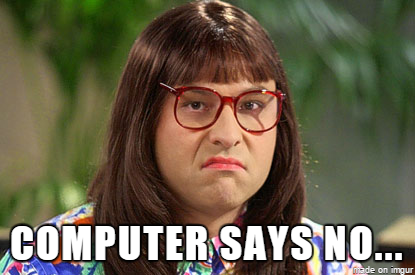

export { default as theme } from './theme'
import { Appear } from 'mdx-deck'
import { Head, Image } from 'mdx-deck'
import nightOwl from 'prism-react-renderer/themes/nightOwl'
import './styles.css';
import { CodeSurfer } from "mdx-deck-code-surfer"
import {Tester} from './tester'

<Head>
  <title>bambuu React Intermediate slides</title>
</Head>

# Intermediate React
### Getting better at React
by Jeppe Reinhold and Gustav Wengel

---

# Introduction & Setup
## Part 1

---

<ul style={{textAlign: 'left',fontSize: '1.5em'}}>
  <li>We are Jeppe and Gustav</li>
  <Appear>
    <li>We’ve done web development and specifically React development for two years</li>
    <li>The workshop is split into 6 parts</li>
	<li>Each with a short presentation followed, by you doing exercises</li>
	<li>We might add or remove exercises during the workshop, to account for your specific level</li>
  </Appear>
</ul>

---

# Agenda

<ol style={{textAlign: 'left',fontSize: '1.5em'}}>
  <Appear>
    <li>Introduction and setup</li>
    <li>Lists and forms</li>
    <li>Component Patterns 1: Higher order Components</li>
	<li>Routing and the location</li>
	<li>Component Patterns 2: Render Props</li>
	<li>Global state with the Context API</li>
  </Appear>
</ol>

---

# Demonstration
## What we'll build
[Final application](LINK-TO-FINAL-APPLICATION)

---

# How we'll build it

<ul style={{textAlign: 'left',fontSize: '1.5em'}}>
  <Appear>
    <li>We have a git repository with all exercises (and slides)</li>
    <li>Each part has its own directory with assignments</li>
    <li>We will be working on the same application throughout the workshop</li>
	<li>So you can always see the solution, by peaking in the directory for the next part</li>
  </Appear>
</ul>

---

# Demonstration
## How it is setup

---

# Assignments - Part 1

1. Clone or download the git repo - [github.com/bambuu/intermediate-react](https://github.com/bambuu/intermediate-react)
2. Open the project with your favorite editor
3. Run `npm run setup`
4. Run `npm run part1`
5. Make sure it works by visiting [localhost:3000](http://localhost:3000)

---

# Working with lists
## Part 2

---

# Component keys 🔑

<ul style={{textAlign: 'left',fontSize: '1.5em'}}>
  <li>React needs a way to uniquely identify components</li>
  <Appear>
    <li>Usually this is handled by React</li>
    <li>But when you <b>dynamically render lists</b>, React can't do that automatically</li>
	<li>Therefore we have to add a <code>key</code> prop to each element in our list</li>
  </Appear>
</ul>

---

# Dynamically rendering lists? 🤔

- When you have an array of items that you use to build JSX elements with
- 99 % of the time you use `array.map()` to do this

---

<CodeSurfer
  title="array.map()"
  code={require("!raw-loader!./examples/array-map-faulty.js")}
  lang="jsx"
  showNumbers={true}
  theme={nightOwl}
  steps={[
    { range: [1,8]},
	{ lines: [2]},
	{ range: [2, 5], notes: 'map array values to JSX elements'},
	{ lines: [7], notes: 'return created elements'},
	{ range: [10,16], notes: 'output'}
  ]}
/>

---

---

<CodeSurfer
  title="array.map()"
  code={require("!raw-loader!./examples/array-map.js")}
  lang="jsx"
  showNumbers={true}
  theme={nightOwl}
  steps={[
	{ tokens: {4: [4,5,6,7,8]}, notes: "adding 'key' prop to element"},
	{ range: [10,16], notes: 'output'}
  ]}
/>

---

# Don't use the array index as key!

<ul style={{textAlign: 'left',fontSize: '1.5em'}}>
  <Appear>
  	<li>What happens if the array gets reordered?</li>
    <li>Or if an item in the middle of the array is removed?</li>
    <li>Or added?</li>
	<li>Indexes are not bound to the item, only it's <b>position</b>!</li>
  </Appear>
</ul>

---

# Using `ref` to reference native elements

---

# The problem

You want to do something with the actual DOM element

<ul style={{textAlign: 'left',fontSize: '1.5em'}}>
  <Appear>
  	<li>Managing focus, text selection, or media playback</li>
    <li>Triggering imperative animations</li>
    <li>Integrating with third-party DOM libraries</li>
  </Appear>
</ul>

---

<CodeSurfer
  title="How do we do that within React?"
  code={require("!raw-loader!./examples/array-map.js")}
  lang="jsx"
  showNumbers={true}
  theme={nightOwl}
  steps={[
	{ tokens: {4: [4,5,6,7,8]}, notes: "adding 'key' prop to element"},
	{ range: [10,16], notes: 'output'}
  ]}
/>

---

# The end - Testing stuff

<Tester/>